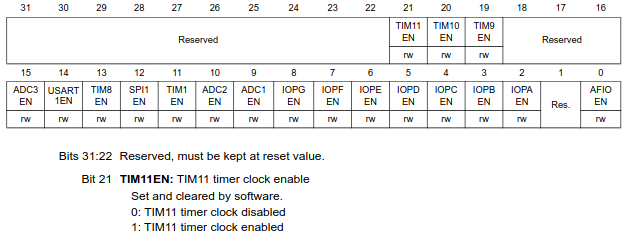

# `01-blink`

### tl;dr

full source [here](https://github.com/samuwall/bluepill-from-scratch/tree/main/01-blink).

in this program, we enable the GPIO Port C peripheral, configure PC13 for output, and write 1 or 0 to PC13 with delays in between in order to blink the LED connected to PC13.

the following write-up walks through the reasoning behind every step that led to the final simple program. every decision is explained, and it shows that we don't need external code or examples to write embedded programs, just the ST/ARM reference manuals and GNU docs.

compile/link:

```txt
arm-none-eabi-gcc -mcpu=cortex-m3 -ffreestanding -nostdlib -Os -T link.ld blink.c -o blink.elf
```

flash:

```txt
./flash.exp blink.elf
```

### from scratch

We want to blink the LED on our bluepill. That is, to repeatedly turn the LED on and off with some delay in between.

How can we control this LED with our microcontroller?

An LED only lights up when there is a complete circuit, where one terminal of the LED is positive (e.g., Vdd / +3.3V) and the other is negative (e.g., Vss / GND / 0V). If both terminals are positive or negative, or if at least one terminal is "open", the circuit is incomplete, no current can flow, and the LED will not light up. Thus, if one LED terminal is always connected to Vdd or GND and the other is connected to an MCU pin, we can control the LED by controlling the voltage on that pin.

These controllable pins are called General Purpose Input and Output pins, or GPIO pins. 

If we can figure out which GPIO pin is connected to the LED, and how to actually output high/low on that pin, we'll have everything needed to blink an LED -- no HAL or OS necessary.

For the blinking part, we really only need 2 separate sources of information:

1.) The Reference Manual for our STM32F103 microcontroller (RM0008). [[1]](https://www.st.com/en/microcontrollers-microprocessors/stm32f103/documentation.html#)

2.) The Bluepill schematic. [[2]](https://stm32-base.org/assets/pdf/boards/original-schematic-STM32F103C8T6-Blue_Pill.pdf)

For STM32 products, the reference manual is addressed towards application developers (us), and tells us everything there is to know about our microcontroller's architecture, memory organization, and peripherals. It's our one-stop-shop for everything specific to this STM32F103. For this program, we will only need to look at the sections _Memory and Bus Architecture_, _Reset and Clock Control_, and _GPIO_. These are sections 3, 7, and 9 respectively.

We need the bluepill schematic simply to see which GPIO pin is connected to our LED, and whether it is connected to the cathode or anode (+/-) terminal of the LED.

Here's the part of the bluepill schematic we're interested in, showing the LED:


PC13 is our pin. We can see that the positive side of the LED is connected to Vdd/Vcc (high), so if we could just pull PC13 low (0V / GND), we would complete the circuit for this LED and cause current to flow -- from the supply (_Vdd_), through the LED, through the current-limiting resistor, through PC13 and the MCU, and back to the supply (_GND_). We do this simply by outputting `0` on PC13. Outputting `0` on a pin effectively shorts the pin to the MCU's GND, which explains how it's able to sink current. We'll look at the mechanism behind this later.

> PC13 stands for GPIO Port C, Pin 13. In this family of MCUs, the GPIO pins are broken up into multiple ports of 16 pins each.

Now the reference manual. Let's just start with Section 3, as it's the first information we get about our microcontroller. The very first figure already helps us a lot in our goal of writing to PC13.


It looks complicated at first glance, but following the arrows, we can see that the Cortex-M3 accesses the AHB through the Bus Matrix, that the AHB is connected to APB1 and APB2, and that GPIOC _(our peripheral of interest)_ is under APB2. We can also see something called RCC communicating with the AHB.

> AHB stands for "Advanced High-performance Bus". APB stands for "Advanced Peripheral Bus". These busses connect our CPU to all of our peripherals.

If we look under "AHB/APB bridges (APB)" on the next page, we get another key piece of information for this MCU:


This tells us that a peripheral needs a clock signal in order to come to life, and that this RCC thing controls where the clock goes, diverting it to whichever peripheral we want to use and gating it from those not in use in order to save power.

Thus, if we assume that `APB2ENR` stands for `APB2 Enable Register`, it looks like we might need to use RCC_APB2ENR to enable GPIOC.

The next paragraph tells us that peripherals and their registers (like `RCC_APB2ENR`) are accessed through normal memory addresses, which is pretty convenient.


And the next page shows the start/end address of every peripheral. We need the start address for RCC and GPIOC.


RCC is at `0x4002 1000`, connected to the AHB.


GPIOC is at `0x4001 1000`, connected to APB2.

Now we can go to the RCC section, section 7. It has three subsections. 7.1 tells us about all of the types of resets, and 7.2 tells us about all of the different clock configurations, e.g., clock sources, clock speed, etc.. None of that matters at this point, so we'll just use the default clock configuration and go on to subsection 7.3: RCC registers. The last subsection of a peripheral always describes its registers.

Looking through the registers, we see that they're all 32-bits wide, and that every bit in those 32-bits is annotated with some meaning. 

> A bit or group of bits with some meaning is called a bitfield. 

We can skim through all of these registers with all of their bitfield definitions and see that none of them other than `RCC_APB2ENR` seem to do anything that we need to worry about, so we can be pretty confident that we aren't missing anything. 


Here's the subsection for the `RCC_APB2ENR` register. It tells us its address offset within the RCC peripheral, its reset value, how it can be accessed, and gives a note that reaffirms what we learned about having to first enable peripherals by enabling their clock. Next is the register's bitfield diagram.



It neatly shows what every bit in the register maps to. Every bitfield is explained and its possible values defined below these diagrams. Bit 4 labeled `IOPCEN` might be what we're looking for.


Looks like all we need to do is set this bit to `1`. 

Now we can move on to the GPIOC peripheral itself.


Looking at the functional description, we have two configuration registers, two data registers, two set/reset registers, and a locking register. It also lists every possible mode with which a GPIO pin can be configured. We can see that pin configuration is done through `GPIOx_CRL` and `GPIOx_CRH`. 


The input modes are for reading high/low logic levels driven by external components. We want to write high/low to our pin with current sourcing/sinking capability, not to simply sample its value, so we know that we definitely need to be outputting on our pin. Now we have to decide between `Output open-drain` and `Output push-pull`, by first figuring out what these two terms mean.

Subsection 9.1.8: `Output configuration` describes the difference:


It explains that both modes have the same behavior when writing a `0` to the output data register, as they both activate something called an `N-MOS`, but that the modes behave differently when a `1` is written. Open-drain mode leaves the port in "Hi-Z", while push-pull mode activates something called a `P-MOS`.

We can look at the GPIO block diagram for some intuition here.


`N-MOS` and `P-MOS` are transistors, they control electrical connections and are themselves controllable by the voltage present on their "gate" terminal. They function like a controllable analog switch. Their symbols help visualize this. The "gate" terminal on the left's voltage is controlled by the output control, and you can imagine that based on this gate voltage the gate either closes (activates) and shorts together the top/bottom terminals, or opens (deactivates) and disconnects the top/bottom terminals. It isn't the gate voltage by itself that controls these transistors though, it's the difference between the gate voltage and the "source" voltage `Vgs` (`Vg - Vs`). Current flows or doesn't flow between the source pin and the drain pin depending on the value of Vgs. Three pins: gate, source, drain.

The source for the P-MOS is Vdd, and the source for the N-MOS is Vss (GND). You can see that they share a drain pin, and that this drain pin _is_ the GPIO pin. Thus, these MOSFETS directly control the electrical connection of the pin.

The difference between the N-MOS and the P-MOS is that the N-MOS gets activated by a positive Vgs while the P-MOS gets activated by a negative Vgs. 

We can now infer what happens at the hardware level. 

In open-drain mode, the output control is only controlling the N-MOS gate while keeping the P-MOS idle (as described in 9.1.8). It does this by keeping the gate voltage at 3.3V/Vdd, thus keeping Vgs at 0v (3.3 - 3.3 = 0) and leaving the P-MOS deactivated and the drain pin disconnected. At the same time, if the ODR contains `0`, the output control sets the N-MOS gate voltage to 3.3V in order to make Vgs positive (3.3 - 0 = +3.3V) and short the drain pin to Vss. If the ODR contains `1`, the output control sets the N-MOS gate voltage to 0V in order to deactivate the N-MOS (0 - 0 = 0V) and leave the drain pin disconnected/floating. Since the P-MOS is also deactivated, the GPIO pin is simply left floating. This is the "Hi-Z" (high-impedance) state that subsection 9.1.8 told us about regarding open-drain. The pin is left at an indeterminate ever-changing voltage, with no capability of sourcing or sinking current, as it is essentially a floating wire connected to nothing. "Tri-state" is another term for this.

Push-pull is different in that now the N-MOS _and_ the P-MOS are actively being used by the output control. Writing a `0` results in +Vgs for the NMOS and a Vgs of 0 for the P-MOS as before, but now when we write a `1`, the output control sets the P-MOS gate voltage to 0V, resulting in a negative Vgs (0 - 3.3 = -3.3V) which activates the P-MOS and causes current to flow between the Vdd source and the drain.

> Don't be confused by what looks like an inverter in front of the P-MOS. This is just the P-MOS symbol, the voltage doesn't get inverted before the gate. It symbolizes how the P-MOS activates on a negative Vgs. Either way, block diagrams like this aren't meant to be exact schematics of the underlying hardware, they're just meant to illustrate/abstract the hardware for the application developer.

To summarize, with push-pull, we can both sink current through Vss with the N-MOS and source current from Vdd with the P-MOS. With open-drain, we can only sink current with the N-MOS or leave the pin floating.

The names now make sense; they describe what happens when a `1` or `0` is output, separated by a hyphen.

Push to 1 -- Pull to 0.

Open -- Drain to 0.

Now we can decide which mode to use for our LED. As long as PC13 is able to sink current to complete the circuit and light the LED, either pushing the voltage to high/3.3V or leaving it floating will stop current from flowing. So either mode works.

We'll go with open-drain.

Now onto the registers. The `GPIOx_CRL` register covers pins 0-7 while `GPIOx_CRH` covers pins 8-15. Since we're trying to configure pin 13 of port C we'll use `GPIOC_CRH`.


We need to set the `MODE13` and `CNF13` bitfields.

For just blinking an LED, `MODE13` can be any of the output modes. These just offer different maximum switching speeds so that you can make a choice between frequency and power consumption. We'll only need about a 1Hz switching speed, so so `2MHz` is plenty. The meaning of `CNF13` depends on the value in `MODE13`. Since we will have set `MODE13` to output, we look at the second set of values. We can choose "`General purpose output Open-drain`". The "Alternate function" outputs are used when the pin is to be acquired by a peripheral like SPI, I2C, etc.

Looking at the binary for each bitfield value, we want to set `MODE13` to `0b10` and `CNF13` to `0b01`.

Once the pin is configured, the value in `GPIOC_ODR` controls the output:


We turn the LED on and off simply by writing `1` or `0` to bit `13`.

Let's start writing the code, starting with a comment header summarizing our previously described goals:

```c
/***********************************************************************************
** file         : blink.c
** description  : blink PC13
**
**  goal                    register        address         bitfields
**  -------------------------------------------------------------------
**  enable GPIOC clock      RCC_APB2ENR     0x4002 1018     bit  4 -> 1 (IOPCEN -> enable)
**  pc13->output mode       GPIOC_CRH       0x4001 1004     bit 21 -> 1 (MODE13 -> output 2MHz)
**  pc13->float (LED OFF)   GPIOC_ODR       0x4001 100C     bit 13 -> 1 (ODR13  -> output 1)
**  pc13->0v    (LED ON)    GPIOC_ODR       0x4001 100C     bit 13 -> 0 (ODR13  -> output 0)
**
**********************************************************************************/
```

We got the register addresses by combining the peripheral base addresses found from section 3.2 (memory map) with the corresponding address offset for each register. E.g., RCC base address is at `0x4002 1000` and the `AP2ENR` is at an offset of `0x18`, resulting in `0x4002 1018`.

> For ultimate simplicity in the final program, we're taking advantage of the fact that `CNF13` (bits 23 & 22) are already set to `0b01` at reset and that `MODE13` is `0b00` at reset. As such, we only need to set bit 21 of `MODE13` to get what we need (output 2MHz open-drain). Best practice would dictate that you first clear the bitfields that you're writing to in order to get a blank slate, in case you're configuring the register after some other code has already touched it. <sub>(or if you don't trust ST to give the correct reset values)</sub>

Now we'll start with our first line of code. As in normal desktop C programming, the first thing we'll do is include our headers.

```c
#include <stdint.h>
```

In embedded, knowing exactly how many bits we're working with is crucial, so we don't want any of the ambiguity that comes with the default data types such as `int` and `unsigned int`. Instead, we use the exact bit width types provided by `stdint.h`.

> If you're wondering how we're able to use `stdint.h` without linking `libc` or any other C library, it's because the C standard requires a minimal subset of library headers to be available even for freestanding [[3]](https://www.open-std.org/jtc1/sc22/wg14/www/docs/n3220.pdf#chapter.4) programs, where minimal library facilities are expected/required to be available. For C99 [[4]](https://www.open-std.org/jtc1/sc22/wg14/www/docs/n1256.pdf), this subset includes <float.h>, <iso646.h>, <limits.h>, <stdarg.h>, <stdbool.h>, <stddef.h>, and <stdint.h>. This is opposed to hosted [[5]](https://www.open-std.org/jtc1/sc22/wg14/www/docs/n3220.pdf#subsection.5.1.2) programs, where the full C standard library is expected to be implemented. If you've installed `arm-none-eabi-gcc` on Linux, you can see that these header files come with the compiler and are found at `/usr/lib/gcc/arm-none-eabi/14.2.0/include/`.

Next we'll use macros to define the register addresses of `RCC_APB2ENR`, `GPIOC_CRH` and `GPIOC_ODR`.

```c
#define RCC_APB2ENR *((volatile uint32_t *) 0x40021018)
#define GPIOC_CRH   *((volatile uint32_t *) 0x40011004)
#define GPIOC_ODR   *((volatile uint32_t *) 0x4001100C)
```

In addition to the address itself, we tell the compiler that this value is pointing to `uint32_t` type data since these are 32-bit wide hardware registers, and we dereference the pointer so that we can interact with the actual register data found at this address. Abstracting these pointer shenanigans into macros like this is much easier on the eyes.

These addresses don't point to areas of flash or RAM, instead, they are special addresses corresponding to peripheral registers. When the bus recognizes such an address, it diverts the load/store signal to the peripheral hardware <sub>(instead of the flash/ram)</sub>, where the peripheral either writes to our data lines for a `load` or latches our `store` data into the selected register. Accessing peripheral hardware through these addresses _as if_ they were normal memory greatly simplifies things for us. This is called `Memory-Mapped I/O`.

Since the values inside these hardware registers can also be changed by the hardware without the software's consent, we need to remind the compiler that it should never assume the value of these registers based on its analysis of the program, as it might for other variables (for optimization purposes). It should also never eliminate, cache, or merge accesses to these registers, as the compiler cannot know the potential side-effects of these actions. This is why we use the `volatile` keyword here [[6]](https://open-std.org/JTC1/SC22/WG14/www/docs/n3220.pdf#page.121), to mark the memory at these addresses as volatile.

We're almost ready to start writing executable code, but first, considering there's no operating system, how and where will execution start? With our completely-from-scratch approach, we can't expect to just define `int main()` and start writing.

According to ARM, at minimum, our Cortex-M3 CPU needs to know the start address of the code which should run at reset, the address of the top of our stack, and the addresses for handling Non-Maskable Interrupts and HardFaults [[7]](https://developer.arm.com/documentation/ddi0337/e/Exceptions/Resets/Vector-Table-and-Reset)[[8]](https://developer.arm.com/documentation/ddi0403/ee/?lang=en)[[9]](https://developer.arm.com/documentation/dui0552/latest/). These addresses are simply placed one after another at the beginning of our flash, where the Cortex-M3 knows to find them and in the order it expects. 

This is called the _vector table_ (since a vector points towards something).

In C, it's simply an array of unsigned 32-bit numbers.

```c
void reset_handler(void) {
    /* TODO */
}

void nmi_handler(void) {
    for(;;);
}

void hardfault_handler(void) {
    for(;;);
}

const uint32_t vector_table[]
__attribute__ ((section(".vectors"))) = {
    (uint32_t) 0x20005000,      /* top of stack = RAM origin + size (20KB) */
    (uint32_t) reset_handler,
    (uint32_t) nmi_handler,
    (uint32_t) hardfault_handler
};
```

We define the array as `const` since we won't be modifying it at run-time. Defining it as `const` is enough for the compiler to place it in flash, but we don't just want it anywhere in flash, we need it at the very beginning of flash where the CPU expects it. We do this by marking this vector table as belonging to a certain "input section", which we can give any name we want. We'll call it `.vectors`. We use the GCC attribute `section()` to do this [[10]](https://gcc.gnu.org/onlinedocs/gcc/Common-Variable-Attributes.html#index-section-variable-attribute). Then, when we write the linker script, we'll inform the linker to place any code belonging to this section at the beginning of flash. Pretty simple. We'll go into linking and sections in more detail when we write the linker script (which is only 5 lines of code).

We make the top of our stack the end of RAM since the CPU will grow the stack downwards. As you might know from desktop C programming, the stack holds necessary data for function entry/exit and local automatic variables, growing and shrinking in size as the program necessitates. We want to give it as much space to grow as possible, so we place it at the very end.

We don't care about any potential sophisticated error handling, so we simply define `nmi_handler` and `hardfault_handler` as infinite loops. We could have also defined one dummy handler and had both point to the same one.

And finally, we write our program in `reset_handler`. It's what we want to run after reset -- after the board powers on.

```c
void reset_handler(void) {

    /* enable GPIOC clock (IOPCEN) */
    RCC_APB2ENR = RCC_APB2ENR | (1 << 4);

    /* PC13 output mode 2MHz (MODE13) */
    GPIOC_CRH = GPIOC_CRH | (1 << 20);

    for(;;) {

        /* LED OFF (ODR13 = 1) */
        GPIOC_ODR = GPIOC_ODR | (1 << 13);

        delay(500000);

        /* LED ON (ODR13 = 0) */
        GPIOC_ODR = GPIOC_ODR & ~(1 << 13);

        delay(500000);

    }

}
```

This is it, our entire blinky program from scratch. 

Enable GPIOC, configure PC13, and turn the LED on and off with delays in between in an infinite loop.

A `1` shifted left by `x` represents bit `x`.

We set bits by bitwise ORing these bits with the current register value, and we clear bits with by bitwise ANDing the inverse of these bits with the current register value.

To illustrate, setting a bit looks like this:

```txt
  0b000   
| 0b100
-------
  0b100
```

and clearing a bit looks like this:

```txt
~(0b100) = 0b011

  0b100
& 0b011
-------
  0b000
```

The reason we read the current register value and perform bitwise operations on that value when writing to these registers is so that we leave the rest of the register untouched. For example, if we had previously configured other pins using these registers, we would be discarding those configurations when we completely rewrite the register with only PC13 set. There are also many registers which contain "reserved" bits, which should also remain untouched. For these two reasons, it's common practice (especially for ST parts) to just unconditionally use these bitwise OR/AND operations when writing to registers. This is called _read-modify-write_. For this program though, we could have just as well written the register values outright (e.g., `GPIOC_ODR = 1 << 13`), and saved some clock cycles and program size in the process.

Now for the delay function, all we need is a loop of some configurable duration.

```c
static void delay(uint32_t n) {
    while (n--) {
        __asm__("nop");
    }
}
```

A simple while loop will do, it loops until `n` gets decremented all the way to zero. Inside the loop we execute an inline assembly `nop` (no operation) instruction. This form of inline assembly with no operands is inherently `volatile`, which in turn guarantees that the compiler won't optimize our loop away. This is why `n` doesn't need a `volatile` tag.

We defined the function as `static` so that the compiler knows this function won't be used externally, and can be inlined if optimal.

That's all for `blink.c`. 

`blink.c` will compile fine, but in order to generate an executable the resulting object file also needs to be linked.

We're using GNU tools, which means we'll be using the `ld` linker.

The official GNU `ld` documentation is great, and we'll look to it here to get all of the information we need regarding linking and writing our linker script [[11]](https://sourceware.org/binutils/docs/ld/Overview.html).


As stated, linking combines separately compiled input object files (.o, .a) and constructs an output object file (executable) from them, mapping input file data to addresses in the output file as instructed by the linker script.

In regular hosted C programming, linking is guided by a default linker script that is provided by `ld` and fit for the target OS [[12]](https://sourceware.org/binutils/docs/ld/Scripts.html). In the bare-metal embedded world though, the default linker script can't possibly know the flash, RAM, etc. start addresses of our specific microcontroller. As such, we're expected to provide our own script. We could use one provided by ST, but instead we'll write it ourselves so that nothing is left to the imagination.

Section 3.1 neatly explains the idea of sections, loadable vs allocatable section contents, VMA vs LMA, and symbols.


Basically, the input file data we discussed before is made up of sections like `.text`, `.bss`, and `.data`. `.text` contains our program code, which we'll want to place in flash so that the program is not lost when power is lost. `.bss` contains uninitialized or zeroed global/static-storage variables, which we'll want to place in RAM so that they're easily accessible. `.data` contains global/static-storage variables which have a non-zero intial value, wherein the initial value is stored in flash and then copied over to RAM. All of this is defined by the ARM EABI (Embedded Application Binary Interface) we briefly mentioned in `00-setup`. ABIs like this standardize object files so that object files from different compilers and even different languages can be linked together.

Most sections contain and load data (loadable + allocatable). Some don't load data but still require an allocation (like `.bss`). Others aren't loadable nor allocatable (like debug sections). In special cases like `.data`, data contents are loaded from one place (flash) and copied to another (RAM). Supporting this requires two addresses (LMA + VMA) to be defined. LMA is where the data comes from (Load Memory Address) and VMA is where the data ends up (Virtual Memory Address). For most sections, LMA = VMA. Our code is purely in flash, so we won't be handling `.data` sections.

If you're feeling overwhelmed, it might be nice to see an example of a valid linker script, shown with a detailed explanation in section 3.3.


Quite simple, and considering our blinky program doesn't consist of any global or static-storage variables (`.data`, `.bss`), our linker script will be even simpler. All we need to do is use the `SECTIONS` command, set the location counter to our flash start address, define the `.text` output section at this address, and match any `.vectors` input sections to it followed by any `.text` input sections.

```c
/***********************************************************************************
** file         : link.ld 
** description  : no libc, no c++, no RAM, minimal linker script
**
**
**********************************************************************************/

SECTIONS
{
    . = 0x8000000;
    .text :
    {
        *(.vectors)
        *(.text)
    }

}
```

That's it, we have our C program and linker script!

> If you read the Cortex-M3 User Guide referenced previously, you may have noticed that the default location for the vector table for these CPUs is `0x0`, and that we've placed our vector table at `0x8000000`. This is because the STM32F103 has a feature which allows code execution to start from either flash, RAM, or "system memory" (a fancy name for the baked-in UART bootloader program) based on the status of the `BOOT` pins at reset [[13]](https://www.st.com/en/microcontrollers-microprocessors/stm32f103/documentation.html#). In this setup, the Cortex-M3 always accesses the vector table at `0x0`, but the STM32 chooses which of the aforementioned three "real" addresses will be "aliased" to `0x0`. By default, the flash (real address starting at `0x8000000`) is also mapped to `0x0`. We could just as well have used `0x0` instead of `0x8000000` here.

The last thing we need to figure out is the set of GCC compiler flags to use. We can't just call `arm-none-eabi-gcc blink.c` without any flags, as we're doing a few things that probably aren't the default behavior for GCC. We're using our own linker script, we're targeting a specific CPU within the ARM ecosystem, and we're foregoing the use of any library or startup code.

We can look to the official GCC documentation for the options (flags) we need to use to specify these things [[14]](https://gcc.gnu.org/onlinedocs/gcc/Invoking-GCC.html) [[15]](https://gcc.gnu.org/onlinedocs/gcc/Option-Summary.html).

Regarding our linker script, "Options for linking" sounds promising. It lists the option `-T <script>`, with the description "use _script_ as linker script." That solves that.

Now to target our Cortex-M3, "ARM Options" under "Machine-Dependent Options" looks to have what we need. It contains the `-mcpu=<name>` option, which as stated causes GCC to implicitly set the values for `-march` and `-mtune`, as well as enable any architecture extensions (floating point, etc.) available to that CPU. Though not obvious from the description, it also implicitly sets `-mthumb`, which we can verify with `gcc -Q --help=target` [[16]](https://gcc.gnu.org/onlinedocs/gcc/Overall-Options.html#index-target-help).

><details> <summary>gcc -Q</summary>
> 
> ```txt
> $ arm-none-eabi-gcc -Q --help=target
> The following options are target specific:
>   -mabi=                                aapcs
>   -mabort-on-noreturn                   [disabled]
>   -mapcs                                [disabled]
>   -mapcs-frame                          [disabled]
>   -mapcs-reentrant                      [disabled]
>   -mapcs-stack-check                    [disabled]
>   -march=                               armv4t
>   -marm                                 [enabled]
>   -masm-syntax-unified                  [disabled]
>   -mbe32                                [enabled]
>   -mbe8                                 [disabled]
>   -mbig-endian                          [disabled]
>   -mbranch-cost=                        -1
>   -mbranch-protection=        
>   -mcallee-super-interworking           [disabled]
>   -mcaller-super-interworking           [disabled]
>   -mcmse                                [disabled]
>   -mcpu=                                arm7tdmi
>   -mfdpic                               [disabled]
>   -mfix-cmse-cve-2021-35465             [disabled]
>   -mfix-cortex-a57-aes-1742098          [disabled]
>   -mfix-cortex-a72-aes-1655431          -mfix-cortex-a57-aes-1742098
>   -mfix-cortex-m3-ldrd                  [disabled]
>   -mflip-thumb                          [disabled]
>   -mfloat-abi=                          soft
>   -mfp16-format=                        none
>   -mfpu=                                auto
>   -mgeneral-regs-only                   [disabled]
>   -mhard-float                          -mfloat-abi=hard
>   -mlibarch=                            armv4t
>   -mlittle-endian                       [enabled]
>   -mlong-calls                          [disabled]
>   -mneon-for-64bits                     [disabled]
>   -mpic-data-is-text-relative           [enabled]
>   -mpic-register=             
>   -mpoke-function-name                  [disabled]
>   -mprint-tune-info                     [disabled]
>   -mpure-code                           [disabled]
>   -mrestrict-it                         [disabled]
>   -msched-prolog                        [enabled]
>   -msingle-pic-base                     [disabled]
>   -mslow-flash-data                     [disabled]
>   -msoft-float                          -mfloat-abi=soft
>   -mstack-protector-guard-offset= 
>   -mstack-protector-guard=              global
>   -mstructure-size-boundary=            8
>   -mthumb                               [disabled]
>   -mthumb-interwork                     [enabled]
>   -mtls-dialect=                        gnu
>   -mtp=                                 soft
>   -mtpcs-frame                          [disabled]
>   -mtpcs-leaf-frame                     [disabled]
>   -mtune=                     
>   -munaligned-access                    [disabled]
>   -mvectorize-with-neon-double          [disabled]
>   -mvectorize-with-neon-quad            [enabled]
>   -mword-relocations                    [disabled]
> ```
>
> ```txt
> $ arm-none-eabi-gcc -Q -mcpu=cortex-m3 --help=target
> The following options are target specific:
>   -mabi=                                aapcs
>   -mabort-on-noreturn                   [disabled]
>   -mapcs                                [disabled]
>   -mapcs-frame                          [disabled]
>   -mapcs-reentrant                      [disabled]
>   -mapcs-stack-check                    [disabled]
>   -march=                               armv7-m
>   -marm                                 [disabled]
>   -masm-syntax-unified                  [enabled]
>   -mbe32                                [enabled]
>   -mbe8                                 [disabled]
>   -mbig-endian                          [disabled]
>   -mbranch-cost=                        -1
>   -mbranch-protection=        
>   -mcallee-super-interworking           [disabled]
>   -mcaller-super-interworking           [disabled]
>   -mcmse                                [disabled]
>   -mcpu=                                cortex-m3
>   -mfdpic                               [disabled]
>   -mfix-cmse-cve-2021-35465             [disabled]
>   -mfix-cortex-a57-aes-1742098          [disabled]
>   -mfix-cortex-a72-aes-1655431          -mfix-cortex-a57-aes-1742098
>   -mfix-cortex-m3-ldrd                  [enabled]
>   -mflip-thumb                          [disabled]
>   -mfloat-abi=                          soft
>   -mfp16-format=                        none
>   -mfpu=                                auto
>   -mgeneral-regs-only                   [disabled]
>   -mhard-float                          -mfloat-abi=hard
>   -mlibarch=                            armv7-m
>   -mlittle-endian                       [enabled]
>   -mlong-calls                          [disabled]
>   -mneon-for-64bits                     [disabled]
>   -mpic-data-is-text-relative           [enabled]
>   -mpic-register=             
>   -mpoke-function-name                  [disabled]
>   -mprint-tune-info                     [disabled]
>   -mpure-code                           [disabled]
>   -mrestrict-it                         [disabled]
>   -msched-prolog                        [enabled]
>   -msingle-pic-base                     [disabled]
>   -mslow-flash-data                     [disabled]
>   -msoft-float                          -mfloat-abi=soft
>   -mstack-protector-guard-offset= 
>   -mstack-protector-guard=              global
>   -mstructure-size-boundary=            8
>   -mthumb                               [enabled]
>   -mthumb-interwork                     [disabled]
>   -mtls-dialect=                        gnu
>   -mtp=                                 soft
>   -mtpcs-frame                          [disabled]
>   -mtpcs-leaf-frame                     [disabled]
>   -mtune=                     
>   -munaligned-access                    [enabled]
>   -mvectorize-with-neon-double          [disabled]
>   -mvectorize-with-neon-quad            [enabled]
>   -mword-relocations                    [disabled]
> ```
></details>

Thus, it seems GCC is intelligent enough to get all of the information it needs about our target machine from this one option. We will use `-mcpu=cortex-m3` by itself and move on.

Now we just need to tell GCC that it can't try to link/use any library or startup code. 

We're pretty sure the default behavior of GCC is to act as a compiler for a hosted implementation, so let's look for a flag relating to freestanding implementations.

The flag `-ffreestanding` [[17]](https://gcc.gnu.org/onlinedocs/gcc/C-Dialect-Options.html#index-ffreestanding-1) seems like what we're looking for. Unfortunately, the description of what exactly this flag accomplishes isn't very specific. It states: "Assert that compilation targets a freestanding environment. This implies -fno-builtin." The description for `-fno-builtin` simply states "Don’t recognize built-in functions that do not begin with ‘__builtin_’ as prefix", but we weren't planning on using any C library functions anyways. So what does `-ffreestanding` really do for us? The latter part of section 2.1 provides some details.


As we can see, it seems that `-ffreestanding` only really sets a macro and tells the compiler not to make any assumptions about function names, which it might otherwise, for reasons such as transforming `memcpy` into an inline byte loop. Well, that only seems mildly useful, but it wouldn't feel right to compile our program with GCC believing it to be for a hosted environment, so we'll keep it. It may also have some other effects not explicitly obvious here (spoiler).

Still, this is only an option controlling how it interprets the code for compilation (being under "Options Controlling the C Dialect"), and as such it might not be enough for ensuring that GCC won't try to link with a `libc` standard library implementation or `libgcc`. We'll need to set another option to ensure that.

We can verify this with `gcc -ffreestanding -###` [[18]](https://gcc.gnu.org/onlinedocs/gcc/Overall-Options.html#index-_0023_0023_0023), which shows `-lgcc -lc` for the `collect2` (`ld`) stage. We can also try to compile/link the program at this stage, which will fail with undefined references to low-level routines needed by `libc` which we have not implemented.

> Note that GCC is just a driver that calls the programs which do the actual work [[19]](https://gcc.gnu.org/onlinedocs/gcc/Overall-Options.html). The full pipeline is: preprocessing (libcpp/cpp) -> compilation proper (cc1) -> assembly (as) -> linking (collect2/ld).

So, we need to tell GCC not to link with `libc` or `libgcc`, nor to call any startup code. Looking under "Options for linking", the option `-nostdlib` seems to satisfy this. 

It looks like we have everything we need at this point.

There's some cause for concern though. The description for this flag explicitly states that "the compiler may generate calls to memcmp, memset, memcpy and memmove", which is a little confusing. This means the compiler might take our manual byte loop and automatically transform it into a `memcpy` call, even though we would no longer have `libc` to provide these functions. Section 2.1 of the GCC docs seems to support this, as it states that "GCC requires the freestanding environment provide memcpy, memmove, memset and memcmp" [[20]](https://gcc.gnu.org/onlinedocs/gcc/Standards.html#C-Language).

We're able to reproduce this behavior when compiling `02-struct` with the `-O3` optimization level. In that case, GCC emits a `memcpy` call for the `reset_handler` byte loop.

However, this is only if `-nostdlib` is specified without `-ffreestanding`. With `-ffreestanding` to influence the actual compilation stage, I guess GCC gets the hint not to emit these standard library calls, especially considering we never called them in the first place. Maybe this falls under the idea of not making any assumptions about the meaning of standard library function names. 

To add to the confusion, there's also the fact that C23 actually added these functions (and others) from `string.h` to the list of required library facilities for freestanding implementations, which might suggest that `-ffreestanding` should still allow these functions to be emitted. Well, that's not what we're seeing in practice at the moment, so let's just move on.

> Upon further review, there are times that GCC emits these `mem*` calls even with `-ffreestanding`. We got this behavior with `09-i2c`, when it transformed the initialization of an array into a `memset`. This is in line with the GCC documentation, but I don't know why `-ffreestanding` by itself was enough to stop the generation of the `memcpy` in `02-struct` but not in `09-i2c`. Luckily I'm not the only one somewhat confused with this behavior [[x]](https://gcc.gnu.org/bugzilla/show_bug.cgi?id=56888)[[x]](https://f.osdev.org/viewtopic.php?t=33589)[[x]](https://stackoverflow.com/questions/67210527/how-to-provide-an-implementation-of-memcpy)[[x]](https://cs107e.github.io/guides/gcc/)[[x]](https://stackoverflow.com/questions/6410595/getting-gcc-to-compile-without-inserting-call-to-memcpy/9426766#9426766). I guess GCC has good reason to make these `mem*` implementations mandatory in all environments, but I wish they weren't. We'll solve this moving forward by manually providing these implementations whenever GCC wants them, and marking them as `used` when we do, so that LTO doesn't throw them away.

Also in the description for `-nostdlib` is a suggestion to separately link with `libgcc`, which `-nostdlib` would otherwise disable. `libgcc` provides stuff like software floating point implementations. In keeping with our "from-scratch" and "no external code" mindset, we won't link with `libgcc`, and hopefully we won't do anything weird to trigger any `libgcc` facilities. If we ever do, the compilation errors will make it clear what happened.

We won't worry about debug flags, we'll enable those and show how to debug through VSCode in the next section (`02-struct`).

Finally, we can choose our optimization level. The most common option for embedded is `-Os`, or "optimize for size" [[21]](https://gcc.gnu.org/onlinedocs/gcc/Optimize-Options.html#index-Os) , which is what we'll use here.

With that, we can compile:

```c
arm-none-eabi-gcc -mcpu=cortex-m3 -ffreestanding -nostdlib -Os -T link.ld blink.c -o blink.elf
```

and flash, either manually as before or with a simple script:

```c
./flash.exp blink.elf
```

[ insert GIF of bluepill blinking ]

Fin.

This was a rather verbose explanation for an exceedingly simple final product, as I tried not to leave any gaps or make any assumptions.

The rest of the programs require a lot less explanation.

### references

[1] [https://www.st.com/en/microcontrollers-microprocessors/stm32f103/documentation.html#](https://www.st.com/en/microcontrollers-microprocessors/stm32f103/documentation.html#)

[2] [https://stm32-base.org/assets/pdf/boards/original-schematic-STM32F103C8T6-Blue_Pill.pdf](https://stm32-base.org/assets/pdf/boards/original-schematic-STM32F103C8T6-Blue_Pill.pdf)

[3] [https://www.open-std.org/jtc1/sc22/wg14/www/docs/n3220.pdf#chapter.4](https://www.open-std.org/jtc1/sc22/wg14/www/docs/n3220.pdf#chapter.4) (4.7)

[4] [https://www.open-std.org/jtc1/sc22/wg14/www/docs/n1256.pdf](https://www.open-std.org/jtc1/sc22/wg14/www/docs/n1256.pdf) (4.6)

[5] [https://www.open-std.org/jtc1/sc22/wg14/www/docs/n3220.pdf#subsection.5.1.2](https://www.open-std.org/jtc1/sc22/wg14/www/docs/n3220.pdf#subsection.5.1.2) (5.1.2.3.3)

[6] [https://open-std.org/jtc1/sc22/wg14/www/docs/n3220.pdf#page.121](https://open-std.org/jtc1/sc22/wg14/www/docs/n3220.pdf#page.121) (6.7.4.1.8)

[7] [https://developer.arm.com/documentation/ddi0337/e/Exceptions/Resets/Vector-Table-and-Reset](https://developer.arm.com/documentation/ddi0337/e/Exceptions/Resets/Vector-Table-and-Reset)

[8] [https://developer.arm.com/documentation/ddi0403/latest/](https://developer.arm.com/documentation/ddi0403/latest/) (B1.5)

[9] [https://developer.arm.com/documentation/dui0552/latest/](https://developer.arm.com/documentation/dui0552/latest/) (2.3)

[10] [https://gcc.gnu.org/onlinedocs/gcc/Common-Variable-Attributes.html#index-section-variable-attribute](https://gcc.gnu.org/onlinedocs/gcc/Common-Variable-Attributes.html#index-section-variable-attribute)

[11] [https://sourceware.org/binutils/docs/ld/Overview.html](https://sourceware.org/binutils/docs/ld/Overview.html)

[12] [https://sourceware.org/binutils/docs/ld/Scripts.html](https://sourceware.org/binutils/docs/ld/Scripts.html)

[13] [https://www.st.com/en/microcontrollers-microprocessors/stm32f103/documentation.html#](https://www.st.com/en/microcontrollers-microprocessors/stm32f103/documentation.html#) (3.4)

[14] [https://gcc.gnu.org/onlinedocs/gcc/Invoking-GCC.html](https://gcc.gnu.org/onlinedocs/gcc/Invoking-GCC.html)

[15] [https://gcc.gnu.org/onlinedocs/gcc/Option-Summary.html](https://gcc.gnu.org/onlinedocs/gcc/Option-Summary.html)

[16] [https://gcc.gnu.org/onlinedocs/gcc/Overall-Options.html#index-target-help](https://gcc.gnu.org/onlinedocs/gcc/Overall-Options.html#index-target-help)

[17] [https://gcc.gnu.org/onlinedocs/gcc/C-Dialect-Options.html#index-ffreestanding-1](https://gcc.gnu.org/onlinedocs/gcc/C-Dialect-Options.html#index-ffreestanding-1)

[18] [https://gcc.gnu.org/onlinedocs/gcc/Overall-Options.html#index-_0023_0023_0023](https://gcc.gnu.org/onlinedocs/gcc/Overall-Options.html#index-_0023_0023_0023)

[19] [https://gcc.gnu.org/onlinedocs/gcc/Overall-Options.html](https://gcc.gnu.org/onlinedocs/gcc/Overall-Options.html)

[20] [https://gcc.gnu.org/onlinedocs/gcc/Standards.html#C-Language](https://gcc.gnu.org/onlinedocs/gcc/Standards.html#C-Language)

[21] [https://gcc.gnu.org/onlinedocs/gcc/Optimize-Options.html#index-Os](https://gcc.gnu.org/onlinedocs/gcc/Optimize-Options.html#index-Os)