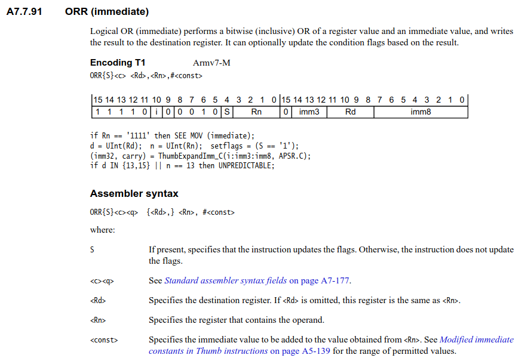
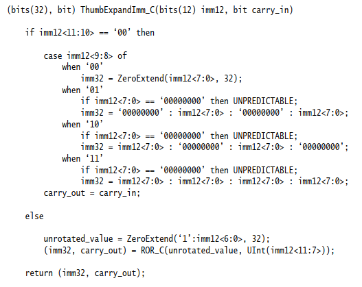
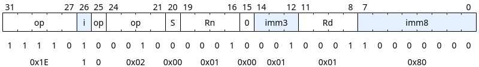
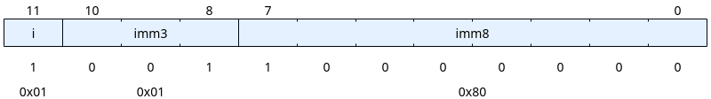
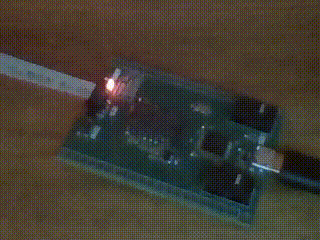

# `01.5-blinkasm`

### tl;dr

full source [here](https://github.com/samuwall/bluepill-from-scratch/tree/main/01.5-blinkasm).

assemble:
```txt
arm-none-eabi-as blink.s -o blink.o
```
link:
```txt
arm-none-eabi-ld -T link.ld blink.o -o blink.elf
```
flash:
```txt
./flash.exp blink.elf
```

### from scratch

Our goal is to write a program in assembly which blinks the LED connected to PC13 of our STM32F103C8T6.

First, we need to know which assembler to use. We'll stick with GNU tools, chiefly `arm-none-eabi-as` and `arm-none-eabi-ld`. This is important information for writing our assembly, as it directly affects the code we write.

> "Assembly" is just any low-level programming language which closely resembles the direct use of a CPU architecture's hardware-level instruction set. It provides syntax that corresponds to instruction encodings, because typing out each instruction bitfield in binary by hand would be an egregious waste of time. We need an assembler to translate the syntax into instruction encodings and do other convenient things.

The next step is to identify our CPU and therefore our architecture/ISA. The STM32F103 microcontroller in our bluepill uses an ARM Cortex-M3 CPU. According to the Cortex-M3 reference manual [[1]](#references), it uses the ARMv7-M architecture which uses a subset of the Thumb-2 ISA. The Thumb-2 ISA is what we're interested in. 

Introduced with the ARMv6T2 architecture [[2]](#references), Thumb-2 is an extension of the pre-UAL 16-bit-only instruction width Thumb ISA. Thumb-2 allows the use of both 16-bit and 32-bit instruction widths, with the idea being to combine code density and performance. With its introduction came the Unified Assembler Syntax (UAL), which provides a single assembly syntax (i.e., the mnemonic and operands of each instruction) to supersede the previous separate syntaxes of the ARM ISA (32-bit) and Thumb ISA (16-bit). The assembler then translates the UAL syntax into the appropriate operations for either Thumb or ARM, or returns errors when an operation is unsupported.

With this information, we write the first three lines of our code. These are GNU Assembler ARM-dependent directives [[3][4]](#references). 

```arm
.syntax unified
.cpu cortex-m3
.thumb
```

`.syntax unified` tells GNU assembler that we're using the ARM UAL, and `.thumb` tells GNU assembler that our CPU supports mixed 16-bit and 32-bit instruction widths, instead of the fixed 32-bit `.arm` ISA. The directive `.cpu cortex-m3` specifies our target processor, so that the assembler may recognize unsupported instructions for this core and issue errors at the time of assembly. Otherwise, it defaults to a permissive mode where certain `.thumb` instructions that we don't support are encoded anyways, resulting in hardfaults at run-time. In our case we only use base Thumb-2 instructions, so it isn't absolutely necessary here.

> You might be wondering why the directive isn't something like `.thumb-2`. This is because in the context of post-UAL assembly, Thumb-2  essentially replaces the old Thumb which used to refer to 16-bit only instructions, such that Thumb now refers to the new mixed 16-bit/32-bit instruction set [[5]](#references). ARM Holdings likes to make stuff as confusing as possible.

With the hard part out of the way <sub>(navigating ARM terminology)</sub> , we can start writing the actual code. We'll start with the vector table and the four entries necessary to start running code.

```arm
.section .vectors
    .word 0x20005000
    .word reset_handler + 1
    .word nmi_handler + 1
    .word hardfault_handler + 1
```

The assembler directive `.section` places the following `.word` values into an input section labeled `.vectors`, which we know our linker script is looking for. This ensures it is placed predictably at the very beginning of the `.text` output section -- and thus the flash -- where the Cortex-M3 can find it, regardless of where in the assembly the vector table is defined. The indentation is purely cosmetic. 

`0x20005000` is the top of our stack. The hardware needs this value in order to know where to start growing the stack downwards. The top of our stack is also the last byte of RAM. Top of stack = end of ram = RAM start + RAM size = 0x20000000 + 20KB = 0x20000000 + 0x5000 = 0x20005000. 

The other three values are the addresses of the interrupt handlers considered the bare-minimum in order for the core to start executing code. `reset_handler` is our code entry point, called upon.. reset. `nmi_handler` (Non-Maskable Interrupt) is needed for serious external failures like power loss, and `hardfault_handler` is needed here for every other type of fault [[6]](#references), most commonly something like an invalid memory access. The processor triggers these handlers so that we stop running application code when something bad happens and can thus do what we need to do before all hell breaks loose, like gracefully shut down or gather valuable debugging information. With these three handlers, the processor is satisfied.

Why are we adding 1 to the handler addresses? It has to do with interworking, which is the ability to switch between ARM (32-bit only) and Thumb (16/32-bit) execution mid-program for performance/code-size reasons. To accommodate this, some instructions which branch to code must use the LSB of the address to denote whether the code being branched to should be executed as Thumb or ARM code, where `1 = Thumb` , and `0 = ARM` [[7][8][9]](#references). Addresses used in these instructions are called "interworking addresses". It seems vector addresses also classify as interworking addresses. In the case of Thumb-only processors like the Cortex-M3, a UsageFault will be generated if bit[0] of any interworking address is not 1, which is why we add 1 to set the handler LSBs. You might be wondering why we need to tell a Thumb-only processor that we are executing Thumb code. For consistency, I guess.

We then switch back to placing code in the `.text` input section, which is where program code normally goes without any directives.

```arm
.section .text
```

With that, we start defining functions. Officially these are called labels, as all they really do is attach a name to an address for our convenience.

```arm
nmi_handler:
    b nmi_handler

hardfault_handler:
    b hardfault_handler
```

Here we simply define `nmi_handler` and `hardfault_handler` as infinite loops, as we did in C. We just use `b` because we are branching unconditionally and don't care about linking.

```arm
.global reset_handler
reset_handler:
```

We use the `.global` directive for `reset_handler` so that the linker script can find it for the `ENTRY()` command. Functions are static/local by default in assembly.

```arm
    ldr  r0, =0x40021018  @ RCC_APB2ENR
    ldr  r1, [r0]
    orr  r1, #0x10        @ set bit 4 (IOPCEN)
    str  r1, [r0]
```

Here we load the address for `RCC_APB2ENR` as a constant using `ldr =` , then access the contents of that address, reading them into `r1`. We set bit 4 with a bitwise `orr` to enable the clock for GPIO port C. We then write the modified contents back into `RCC_APB2ENR` with `str`.

Our first instruction here (`ldr <reg>, =<expression>`) is a "psuedo-instruction", in that it's sort of a placeholder that gets translated by the assembler into a different instruction. It isn't defined as a single instruction by either the ARM Cortex-M3 or ARMv7-M reference manuals. Instead, it's defined by the assembler, here [[10]](#references) for GNU and here [[11]](#references) for armasm. It's useful in that it automatically gets translated into the most efficient single instruction for loading any constant, either into a `mov` or `movw` if the constant fits in the instruction, or into an `ldr Rd, [PC, #offset]` by creating a literal pool (`.word`) for the constant and calculating the PC offset for referencing the literal pools. Without the assembler, this process would be tedious and error-prone. We could also do something like:

```arm
.equ    RCC_APB2ENR, 0x40021018

    movw    r0, #:lower16:RCC_APB2ENR
    movt    r0, #:upper16:RCC_APB2ENR
```

which should be faster, but I chose to target smaller code size with `ldr =` [[12]](#references) . 

The next section is very similar.

```arm
    ldr  r0, =0x40011004  @ GPIOC_CRH
    ldr  r1, [r0]
    orr  r1, #0x100000    @ set bit 20
    str  r1, [r0]
```

We do the same thing here for `GPIOC_CRH`, setting bit 20 to enable output mode for PC13. 

If you're wondering how we fit that huge 21-bit immediate into the 32-bit `orr` instruction, it's because the constant is encoded in such a way that it gets broken down into a constant and a rotate right value, such that even 32-bit immediates may fit into only 12 instruction bits. Not all 32-bit values can be encoded this way, as it only fits values that can be constructed by taking an 8-bit value and rotating it by a 5-bit (0-31) value. It works well for setting bits and bitfields 8-bits wide or less that are shifted some amount, but a value like `0x12345678` for example cannot be encoded this way. The exact logic is described in psuedocode by the ARMv7-M reference manual:

> <details>
> <summary>ORR</summary>
>
> 
> 
> As you can see, the immediate is encoded into `i:imm3:imm8` and passed to the function `ThumbExpandImm_C()`.
> 
> ```txt
> (imm32, carry) = ThumbExpandImm_C(i:imm3:imm8, APSR.C);
> ```
> 
> Here's the logic for `ThumbExpandImm_C()`. 
> 
> 
>
> To demonstrate, I'll skip ahead and grab the disassembly of our `orr` instruction, which will have the full instruction encoding that the assembler generated.
> 
> ```txt
> f441 1180 	orr.w	r1, r1, #1048576	@ 0x100000
> ```
> 
> Converting the instruction encoding `0xf441 1180` into binary, we can see the values for `i`, `imm3`, and `imm8`:
> 
> 
> 
> and if we create `imm12` from these bitfields,
> 
> 
> 
> we can plug it into `ThumbExpandImm_C(imm12, carry_in)` to get:
> 
> ```txt
> ROR_C(0x80, 19)
> ```
> 
> A.k.a., rotate right `0x80` by `19` bits. This is also known as a circular right shift.
> 
> ```txt
> 00000000000000000000000010000000	
> Rotate Right               >> 19	
> --------------------------------
> 00000000000100000000000000000000
> = 0x100000 = 1048576 = (1 << 20)
> ```
>
> And thus, we get our original 21-bit immediate for `(1 << 20)`.
>
> Fortunately, the assembler generates these encodings for us.
>
> </details>

With RCC and GPIOC configured, it's time to blink the LED.

```arm
    ldr  r2, =0x4001100C  @ GPIOC_ODR

main_loop:
```

Here we load the address of `GPIOC_ODR` into `r2` and enter our `main_loop`.

```arm
main_loop:

    ldr  r1, [r2]
    orr  r1, #0x2000      @ set bit 13 (turn off LED)
    str  r1, [r2]
    ldr  r0, =500000      @ delay cntr = 500000

delay_1:
    subs r0, #1
    bne  delay_1

    ldr  r1, [r2]
    bic  r1, #0x2000        @ clear bit 13 (turn on LED)
    str  r1, [r2]
    ldr  r0, =50000         @ reset delay cntr to 50000

delay_2:
    subs r0, #1
    bne  delay_2

    b    main_loop          @ repeat
```

In our `main_loop`, we set PC13, delay, clear PC13, delay, and repeat. 

The `s` suffix in `subs` means that the instruction updates the flags, including the Zero (Z) flag, which `bne` checks before branching. It loops until `r0` is 0.

We also set the delay counter for `delay_2` to be 10x shorter, just to distinguish it from our prior blink programs written in C.

Now it's time to see if we really get a blinking LED.

Assemble,
```txt
arm-none-eabi-as blink.s -o blink.o
```
link,
```txt
arm-none-eabi-ld -T STM32F103C8T6.ld blink.o -o blink.elf
```
and flash:
```txt
./flash.exp blink.elf
```



Heck yea.

It'd be kinda fun to see if we made any improvements in code size, so let's compare:
```txt
[01-blinkasm]$ arm-none-eabi-size blink.elf
   text	   data	    bss	    dec	    hex	filename
     92	      0	      0	     92	     5c	blink.elf

[02-blink]$ arm-none-eabi-size blink.elf
   text	   data	    bss	    dec	    hex	filename
     88	      0	      0	     88	     58	blink.elf
```

Damn.. 4 extra bytes compared to the same program written in C and compiled with `-Os`. I guess we'll let GCC write the assembly from now on.

If you're curious, the following tab dives into the disassemblies to show how they saved those 4 bytes.

> <details> <summary> comparison </summary>
> 
> ```txt
> arm-none-eabi-objdump -d blink.elf
> ```
> 
> <details>
> 
> <summary>blink.c disassembly</summary>
> 
> ```arm
> #################
> ## blink.c (-Os)
> #################
> 
> blink.elf:     file format elf32-littlearm
> 
> 
> Disassembly of section .text:
> 
> 08000000 <vector_table>:
>  8000000:	00 50 00 20 15 00 00 08 11 00 00 08 13 00 00 08     .P. ............
> 
> 08000010 <nmi_handler>:
>  8000010:	e7fe      	b.n	8000010 <nmi_handler>
> 
> 08000012 <hardfault_handler>:
>  8000012:	e7fe      	b.n	8000012 <hardfault_handler>
> 
> 08000014 <reset_handler>:
>  8000014:	4a0d      	ldr	r2, [pc, #52]	@ (800004c <reset_handler+0x38>)
>  8000016:	6993      	ldr	r3, [r2, #24]
>  8000018:	f043 0310 	orr.w	r3, r3, #16
>  800001c:	6193      	str	r3, [r2, #24]
>  800001e:	4b0c      	ldr	r3, [pc, #48]	@ (8000050 <reset_handler+0x3c>)
>  8000020:	685a      	ldr	r2, [r3, #4]
>  8000022:	f442 1280 	orr.w	r2, r2, #1048576	@ 0x100000
>  8000026:	605a      	str	r2, [r3, #4]
>  8000028:	68da      	ldr	r2, [r3, #12]
>  800002a:	f442 5200 	orr.w	r2, r2, #8192	@ 0x2000
>  800002e:	60da      	str	r2, [r3, #12]
>  8000030:	4a08      	ldr	r2, [pc, #32]	@ (8000054 <reset_handler+0x40>)
>  8000032:	bf00      	nop
>  8000034:	3a01      	subs	r2, #1
>  8000036:	d1fc      	bne.n	8000032 <reset_handler+0x1e>
>  8000038:	68da      	ldr	r2, [r3, #12]
>  800003a:	f422 5200 	bic.w	r2, r2, #8192	@ 0x2000
>  800003e:	60da      	str	r2, [r3, #12]
>  8000040:	4a04      	ldr	r2, [pc, #16]	@ (8000054 <reset_handler+0x40>)
>  8000042:	bf00      	nop
>  8000044:	3a01      	subs	r2, #1
>  8000046:	d1fc      	bne.n	8000042 <reset_handler+0x2e>
>  8000048:	e7ee      	b.n	8000028 <reset_handler+0x14>
>  800004a:	bf00      	nop
>  800004c:	40021000 	.word	0x40021000
>  8000050:	40011000 	.word	0x40011000
>  8000054:	0007a120 	.word	0x0007a120
> ```
> 
> </details>
> 
> <details>
> 
> <summary>blink.s disassembly</summary>
> 
> ```arm
> #################
> ## blink.s
> #################
> 
> blink.elf:     file format elf32-littlearm
> 
> 
> Disassembly of section .text:
> 
> 08000000 <nmi_handler-0x10>:
>  8000000:	20005000 	.word	0x20005000
>  8000004:	08000015 	.word	0x08000015
>  8000008:	08000011 	.word	0x08000011
>  800000c:	08000013 	.word	0x08000013
> 
> 08000010 <nmi_handler>:
>  8000010:	e7fe      	b.n	8000010 <nmi_handler>
> 
> 08000012 <hardfault_handler>:
>  8000012:	e7fe      	b.n	8000012 <hardfault_handler>
> 
> 08000014 <reset_handler>:
>  8000014:	480d      	ldr	r0, [pc, #52]	@ (800004c <delay_2+0x8>)
>  8000016:	6801      	ldr	r1, [r0, #0]
>  8000018:	f041 0110 	orr.w	r1, r1, #16
>  800001c:	6001      	str	r1, [r0, #0]
>  800001e:	480c      	ldr	r0, [pc, #48]	@ (8000050 <delay_2+0xc>)
>  8000020:	6801      	ldr	r1, [r0, #0]
>  8000022:	f441 1180 	orr.w	r1, r1, #1048576	@ 0x100000
>  8000026:	6001      	str	r1, [r0, #0]
>  8000028:	4a0a      	ldr	r2, [pc, #40]	@ (8000054 <delay_2+0x10>)
> 
> 0800002a <main_loop>:
>  800002a:	6811      	ldr	r1, [r2, #0]
>  800002c:	f441 5100 	orr.w	r1, r1, #8192	@ 0x2000
>  8000030:	6011      	str	r1, [r2, #0]
>  8000032:	4809      	ldr	r0, [pc, #36]	@ (8000058 <delay_2+0x14>)
> 
> 08000034 <delay_1>:
>  8000034:	3801      	subs	r0, #1
>  8000036:	d1fd      	bne.n	8000034 <delay_1>
>  8000038:	6811      	ldr	r1, [r2, #0]
>  800003a:	f421 5100 	bic.w	r1, r1, #8192	@ 0x2000
>  800003e:	6011      	str	r1, [r2, #0]
>  8000040:	f24c 3050 	movw	r0, #50000	@ 0xc350
> 
> 08000044 <delay_2>:
>  8000044:	3801      	subs	r0, #1
>  8000046:	d1fd      	bne.n	8000044 <delay_2>
>  8000048:	e7ef      	b.n	800002a <main_loop>
>  800004a:	0000      	.short	0x0000
>  800004c:	40021018 	.word	0x40021018
>  8000050:	40011004 	.word	0x40011004
>  8000054:	4001100c 	.word	0x4001100c
>  8000058:	0007a120 	.word	0x0007a120
> 
> ```
> 
> </details>
> 
> 
> First of all, while looping they used 2 `nop` instructions to our 0, which means they're starting from a 4-byte deficit and need to otherwise save 8 bytes.
> 
> They saved 4 bytes here by using offsets instead of 2 separate words,
> 
> ```arm
> 8000050:	40011000 	.word	0x40011000
> 
> vs.
> 
> 8000050:	40011004 	.word	0x40011004
> 8000054:	4001100c 	.word	0x4001100c
> ```
> 
> They saved 2 bytes here by re-using the GPIOC register and adding the offset instead of defining a separate register
> 
> ```arm
>  8000028:	68da      	ldr	r2, [r3, #12]
>  800002a:	f442 5200 	orr.w	r2, r2, #8192	@ 0x2000
> 
> vs.
> 
>  8000028:	4a0a      	ldr	r2, [pc, #40]	@ (8000054 <delay_2+0x10>)
> 
>  800002a <main_loop>:
>  800002a:	6811      	ldr	r1, [r2, #0]
>  800002c:	f441 5100 	orr.w	r1, r1, #8192	@ 0x2000
> 
> ```
> 
> And finally they saved another 2 bytes here when our `ldr =` got translated into a `movw` instruction, which is 32 bits wide.
> 
> ```arm
>  8000040:	4a04      	ldr	r2, [pc, #16]	@ (8000054 <reset_handler+0x40>)
> 
> vs.
> 
>  8000040:	f24c 3050 	movw	r0, #50000	@ 0xc350
> 
> ```
> 
> This happened because we used 50,000 instead of 500,000 for the second delay. 500,000 was already defined for the first delay, so `blink.c` was able to just re-use that `.word` value with a 16-bit `ldr` instruction. Our `blink.s` on the other hand had to define both 500,000 as a `.word` and 50,000 as an immediate within a 32-bit `movw` instruction.
> 
> Those are the 8 bytes!
> 
> Also, if you were curious about this instruction, it's to align the upcoming `.word` values to 4 bytes. GCC did it with a `nop`.
> ```arm
>  800004a:	0000      	.short	0x0000
> ```
> 
> When we applied the first 2 changes and saved 6 bytes, we automatically saved another 2 bytes when our literal pools happened to get word-aligned, removing the need for the 16-bit, 2 byte `.short` directive. So, we saved the 8 bytes without sacrificing our distinguishing asymmetrical blink delay!
>
> Here's our program with those 8 bytes reclaimed if you're interested:
> 
> <details>
> 
> <summary>blink.s</summary>
> 
> ```arm
> .syntax unified
> .cpu cortex-m3
> .thumb
> 
> .section .isr_vector
>     .word 0x20005000
>     .word reset_handler + 1
>     .word nmi_handler + 1
>     .word hardfault_handler + 1
> 
> nmi_handler:
>     b nmi_handler
> 
> hardfault_handler:
>     b hardfault_handler
> 
> .global reset_handler
> reset_handler:
> 
>     ldr  r0, =0x40021018     @ RCC_APB2ENR
>     ldr  r1, [r0]
>     orr  r1, #0x10           @ set bit 4 (IOPCEN)
>     str  r1, [r0]
> 
>     ldr  r0, =0x40011004     @ GPIOC_CRH
>     ldr  r1, [r0]
>     orr  r1, #0x100000       @ set bit 20 (output 10MHz, open-drain)
>     str  r1, [r0]
> 
> main_loop:
>     ldr  r1, [r0, #8]        @ GPIOC_ODR 0x4001100C
>     orr  r1, #0x2000         @ set bit 13 (turn off LED)
>     str  r1, [r0, #8]
>     ldr  r1, =500000         @ delay cntr = 500000
> 
> delay_1:
>     subs r1, #1
>     bne  delay_1
> 
>     ldr  r1, [r0, #8]
>     bic  r1, #0x2000        @ clear bit 13 (turn on LED)
>     str  r1, [r0, #8]
>     ldr  r1, =50000         @ reset delay cntr to 50000
> 
> delay_2:
>     subs r1, #1
>     bne  delay_2
> 
>     b    main_loop          @ repeat
> ```
> </details>
> 
> ```txt
> [samu@yoga 01-blinkasm]$ arm-none-eabi-size blink.elf
>    text	   data	    bss	    dec	    hex	filename
>      84	      0	      0	     84	     54	blink.elf
> ```
> 
> </details>

If we wanted to make our program and linker script as minimal as possible, we can forego the separate input section for the vector table and rely on defining it at the top of our assembly code. 

An absolutely minimal script/assembly combination would look like the following:

> <details> <summary>minblink</summary>
> 
> ```arm
> /* minlink.ld */
> 
> SECTIONS
> {
>     . = 0x8000000;
>     .text :
>     {
>         *(.text)
>     }
> }
> ```
> 
> ```arm
> /* minblink.s */
> 
> .syntax unified
> .thumb
> 
> .word 0x20005000
> .word reset_handler + 1
> .word nmi_handler + 1
> .word hardfault_handler + 1
> 
> nmi_handler:
>     b nmi_handler
> 
> hardfault_handler:
>     b hardfault_handler
> 
> reset_handler:
>     ldr  r0, =0x40021018    @ RCC_APB2ENR
>     ldr  r1, [r0]
>     orr  r1, #0x10          @ set bit 4 (IOPCEN)
>     str  r1, [r0]
> 
>     ldr  r0, =0x40011004    @ GPIOC_CRH
>     ldr  r1, [r0]
>     orr  r1, #0x100000      @ set bit 20 (output 10MHz, open-drain)
>     str  r1, [r0]
> 
> main_loop:
>     ldr  r1, [r0, #8]       @ GPIOC_ODR 0x4001100C
>     orr  r1, #0x2000        @ set bit 13 (turn off LED)
>     str  r1, [r0, #8]
>     ldr  r1, =500000        @ delay cntr = 500000
> 
> delay_1:
>     subs r1, #1
>     bne  delay_1
> 
>     ldr  r1, [r0, #8]       @ GPIOC_ODR 0x4001100C
>     bic  r1, #0x2000        @ clear bit 13 (turn on LED)
>     str  r1, [r0, #8]
>     ldr  r1, =50000         @ reset delay cntr to 50000
> 
> delay_2:
>     subs r1, #1
>     bne  delay_2
> 
>     b    main_loop          @ repeat
> ```
> </details>

That about does it.

It was fun, but I think I'll stick with C.

### references

[1] [https://developer.arm.com/documentation/ddi0337/e/Introduction/Components--hierarchy--and-implementation/Processor-core?lang=en](https://developer.arm.com/documentation/ddi0337/e/Introduction/Components--hierarchy--and-implementation/Processor-core?lang=en)

[2] [https://developer.arm.com/documentation/ddi0403/d/Application-Level-Architecture/The-ARMv7-M-Instruction-Set/About-the-instruction-set?lang=en](https://developer.arm.com/documentation/ddi0403/d/Application-Level-Architecture/The-ARMv7-M-Instruction-Set/About-the-instruction-set?lang=en)

[3] [https://sourceware.org/binutils/docs/as/ARM-Directives.html](https://sourceware.org/binutils/docs/as/ARM-Directives.html)

[4] [https://sourceware.org/binutils/docs/as/ARM_002dInstruction_002dSet.html](https://sourceware.org/binutils/docs/as/ARM_002dInstruction_002dSet.html)

[5] [https://developer.arm.com/documentation/den0013/d/Introduction-to-Assembly-Language/Identifying-assembly-code](https://developer.arm.com/documentation/den0013/d/Introduction-to-Assembly-Language/Identifying-assembly-code)

[6] [https://developer.arm.com/documentation/ddi0403/d/System-Level-Architecture/System-Level-Programmers--Model/ARMv7-M-exception-model/Overview-of-the-exceptions-supported?lang=en](https://developer.arm.com/documentation/ddi0403/d/System-Level-Architecture/System-Level-Programmers--Model/ARMv7-M-exception-model/Overview-of-the-exceptions-supported?lang=en)

[7] [https://developer.arm.com/documentation/dui0552/a/the-cortex-m3-processor/exception-model/vector-table](https://developer.arm.com/documentation/dui0552/a/the-cortex-m3-processor/exception-model/vector-table)

[8] [https://developer.arm.com/documentation/ddi0337/h/programmers-model/exceptions?lang=en](https://developer.arm.com/documentation/ddi0337/h/programmers-model/exceptions?lang=en)

[9] [https://developer.arm.com/documentation/ddi0403/ee/?lang=en](https://developer.arm.com/documentation/ddi0403/ee/?lang=en) (A4.1.1)

[10] [https://sourceware.org/binutils/docs/as/ARM-Opcodes.html](https://sourceware.org/binutils/docs/as/ARM-Opcodes.html)

[11] [https://developer.arm.com/documentation/dui0473/m/writing-arm-assembly-language/load-immediate-values-using-ldr-rd---const](https://developer.arm.com/documentation/dui0473/m/writing-arm-assembly-language/load-immediate-values-using-ldr-rd---const)

[12] [https://community.arm.com/arm-community-blogs/b/architectures-and-processors-blog/posts/how-to-load-constants-in-assembly-for-arm-architecture](https://community.arm.com/arm-community-blogs/b/architectures-and-processors-blog/posts/how-to-load-constants-in-assembly-for-arm-architecture)
